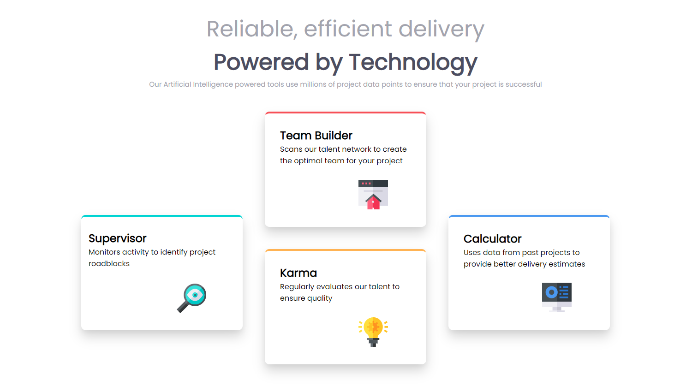

# Frontend Mentor - Four card feature section solution

This is a solution to the [Four card feature section challenge on Frontend Mentor](https://www.frontendmentor.io/challenges/four-card-feature-section-weK1eFYK). Frontend Mentor challenges help you improve your coding skills by building realistic projects. 

## Table of contents

- [Overview](#overview)
  - [The challenge](#the-challenge)
  - [Screenshot](#screenshot)
  - [Links](#links)
- [My process](#my-process)
  - [Built with](#built-with)
  - [What I learned](#what-i-learned)
  - [Continued development](#continued-development)
  - [Useful resources](#useful-resources)
- [Author](#author)
- [Acknowledgments](#acknowledgments)

## Overview

### The challenge

Users should be able to:

- View the optimal layout for the site depending on their device's screen size

### Screenshot

### Links

- Solution URL: [Github Repo](https://github.com/Robert-Thaiyah/four-card-section-feature)
- Live Site URL: [Live site URL](https://your-live-site-url.com)

## My process

- First I created one card and made sure it was perfect then duplicated the card and copied the other content on them.
- Decided to go with a grid structure as using margin-left and margin-right to align the items was a waste of time and headache-inducing.
- Using the grid-template-columns made it easy to move around the cards till they looked the same as the design provided.
- Grid columns also helped them have equal spacing. If I was to use the margin-left and margin-right measurements, they would have looked bad.

### Built with

- Semantic HTML5 markup
- CSS custom properties
- Flexbox
- CSS Grid

### What I learned

- CSS grids help immensly to align items properly. I shall try to see of grid-areas can replicate the same final solution.

### Continued development

- CSS grids and Flex work well and will be practising on it fully.

### Useful resources

- [CSS Grid Cheatsheet](https://grid.malven.co/) - Best CSS grid cheatsheet on the web. Serioulsy, bookmark it.
- [Box Shadow templates](https://getcssscan.com/css-box-shadow-examples) - I know you are lazy as I am. 

## Author

- Website - [Robert Thaiyah](https://github.com/Robert-Thaiyah)

## Acknowledgments

